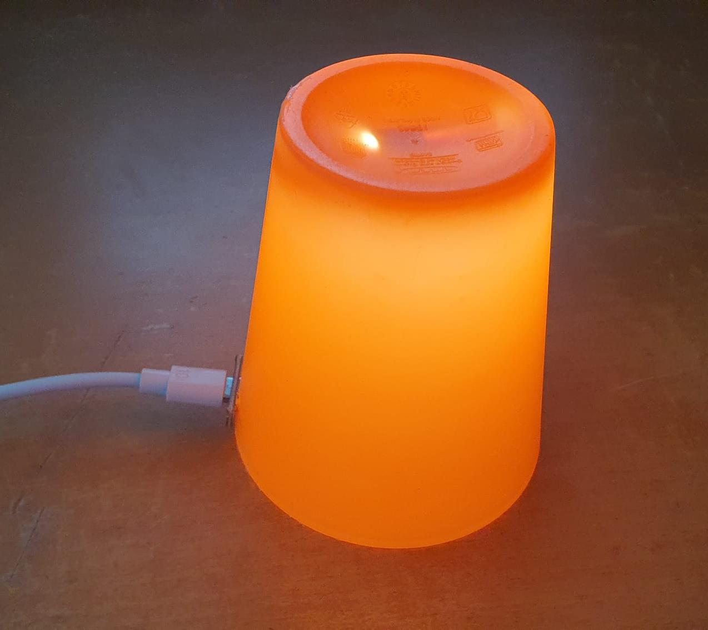
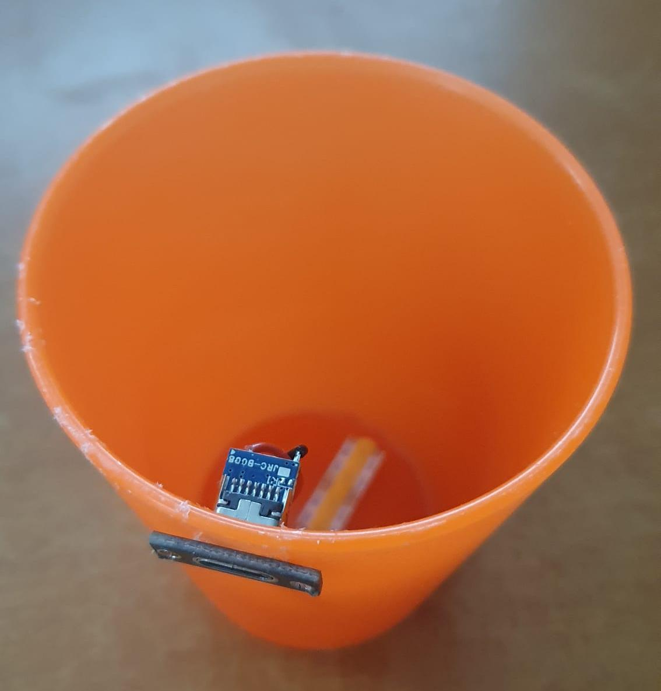
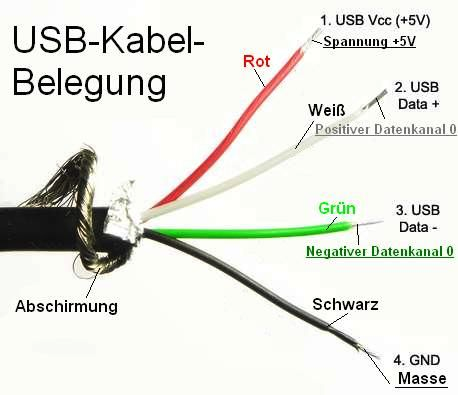
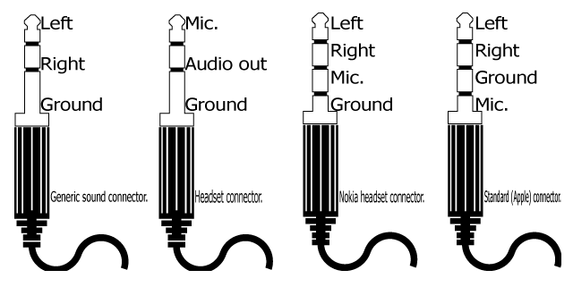
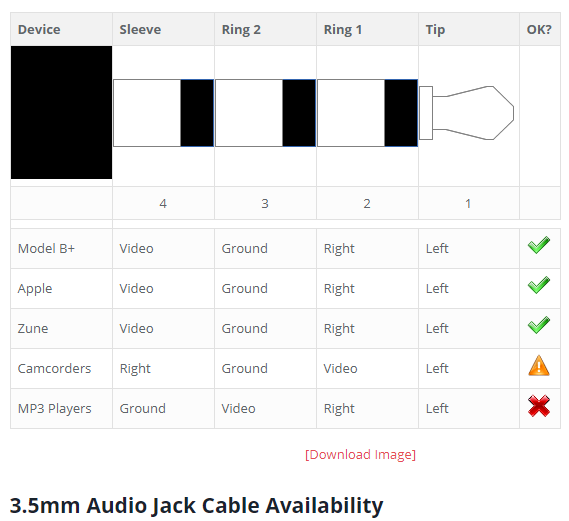
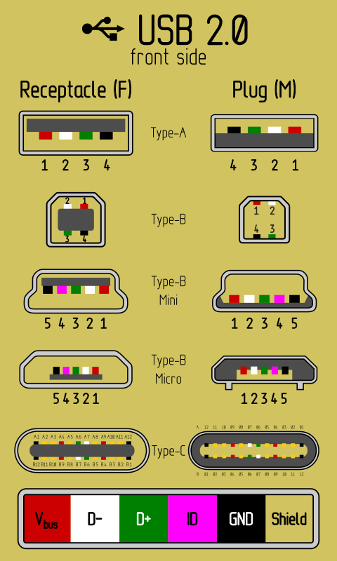
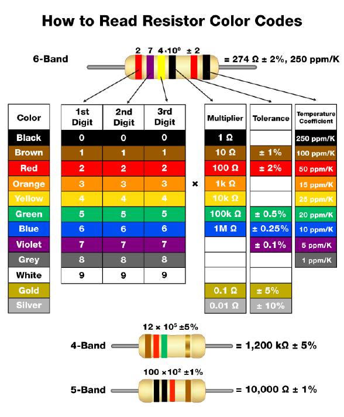
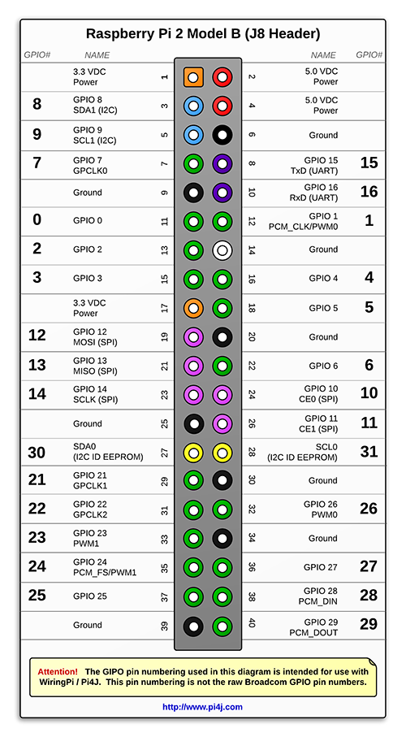
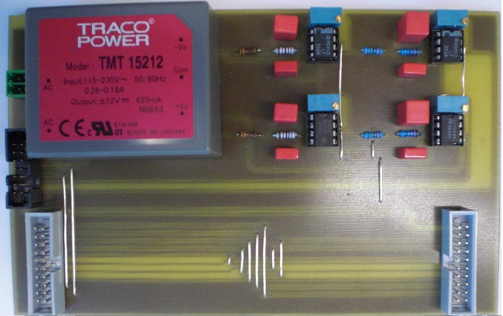
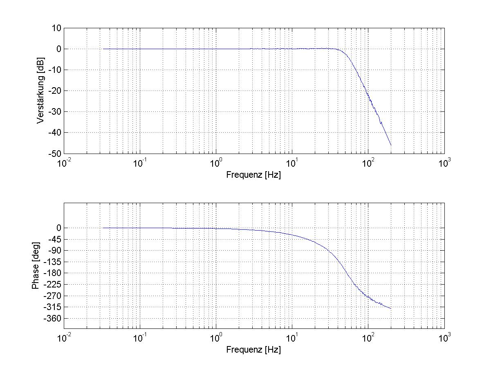

# Electronics 
## LINKS
- [Main](../README.md)

## Projects 
|Description|Date|Image Final|Image Sketch|Details
|-|-|-|-|-|
|  Servo Walker | 05.01.2026 | | |  |
|  Sleep Light | 04.07.2025 | | |  |
|  Soundbox (Raspberry Pi & RFID) | 04.07.2016 | | | A soundbox inspired by the "Tony Box" — each cover sheet is identified by an RFID tag and triggers six distinct sounds. |

## Pinouts 
|Description|Date|Image Final|Image Sketch|Details
|-|-|-|-|-|
|  USB Cable Colors | 01.07.2025 | | | John Beal,2007, [USB Power for RH1 HiMD from external batteries](https://www.bealecorner.org/best/measure/USB/index.html) |
| ESP8266 | 01.01.2020 | | | [ESP8266 Pinout Reference](https://i0.wp.com/randomnerdtutorials.com/wp-content/uploads/2019/05/ESP8266-NodeMCU-kit-12-E-pinout-gpio-pin.png?quality=100&strip=all&ssl=1) |
|  Jack pin out variants  | 12.09.2018 | | |  |
|  Jack 4 Pole | 12.09.2018 | | | [www.elektroda.com](https://www.elektroda.com/rtvforum/topic3430105.html) |
|  USB plugs and sockets | 12.09.2018 | | | [USB 2.0 pinout by Rones](https://openclipart.org/detail/334216/usb-20-pinout-by-rones) |
|  Resistor ColorCodes | 11.09.2018 | | |  |
| Raspberrypi2B | 01.01.2016 | | | [The Pi4J Project](https://www.pi4j.com/1.2/pins/model-2b-rev1.html) |

## Test Bench 
|Description|Date|Image Final|Image Sketch|Details
|-|-|-|-|-|
| Common Rail Test Bench (PHD) | 10.12.2012 | | | angular synchronous controller for high pressure pump and injectors |
| Active Lowpass | 22.07.2010 | | | Active 4th-order Butterworth low-pass filter for suppressing 50 Hz oscillations in the analog RPM signal caused by the power supply. |

