# Craft-Projects 

This overview only includes newer crafting projects, as I have not yet documented the older ones.

## LINKS
- [Wood_Working](./Wood_Working/Project_Overview.md)
- [3D_Print](./3D_Print/Project_Overview.md)
- [Electronics](./Electronics/Project_Overview.md)

## Best of my Projects
|Description|Date|Image Final|Image Sketch
|-|-|-|-|
|  Frame Groot  | 01.02.2026 | 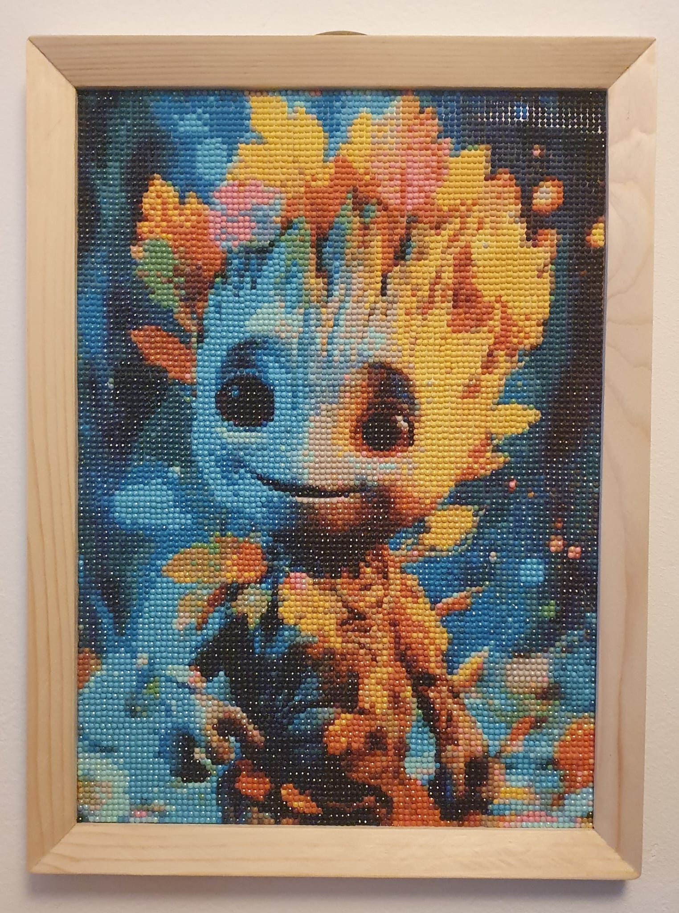|
| Sharpener Jig for chisels | 25.01.2026 | | |
|  Servo Walker | 05.01.2026 | | |
| Upholstery Chair | 25.10.2025 | 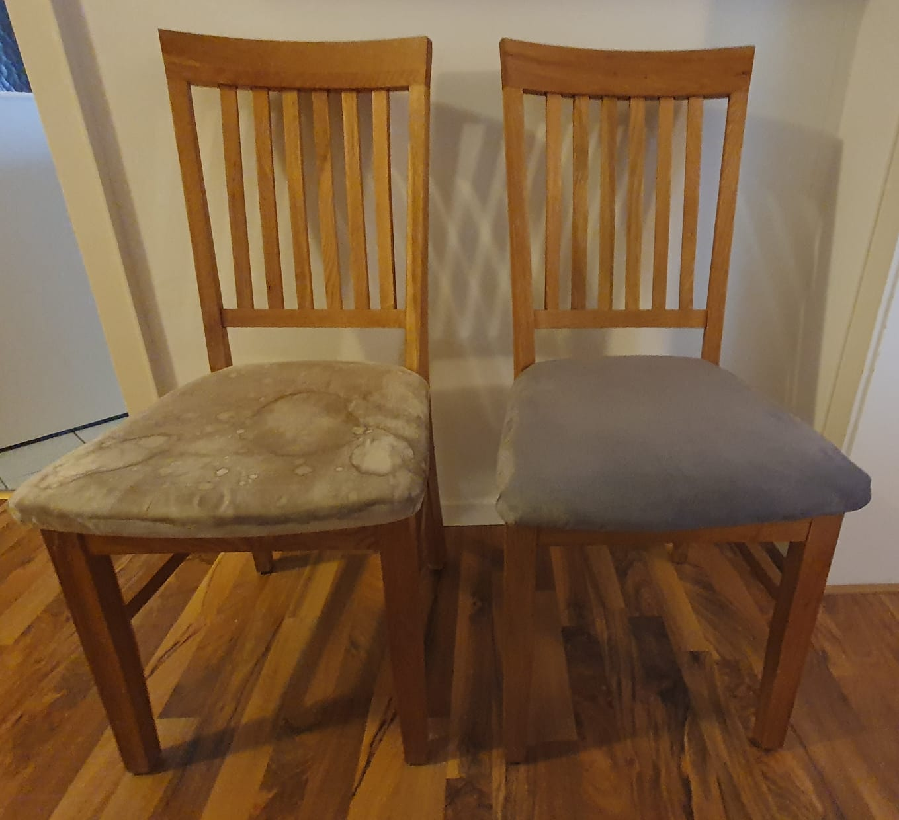| 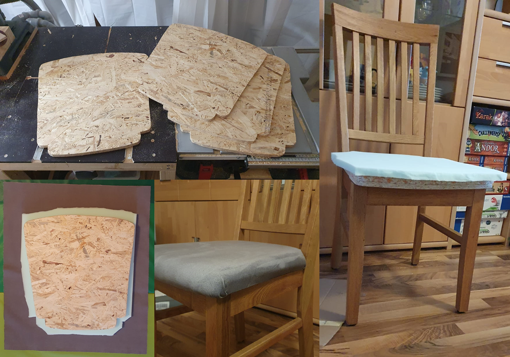|
|  Lamp  | 02.03.2025 | 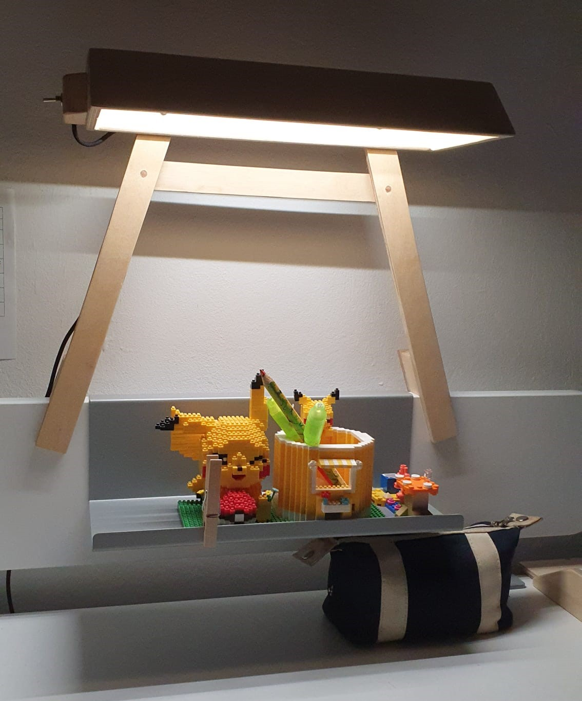| 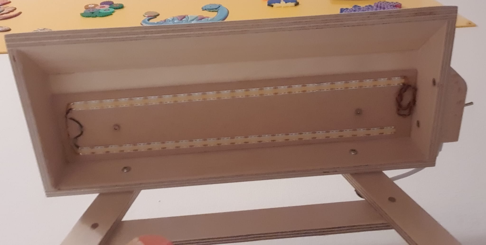|
|  Sliding Door  | 17.09.2022 | 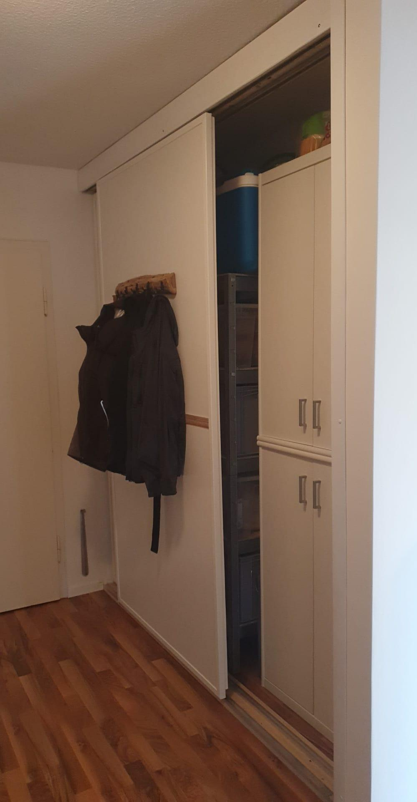| 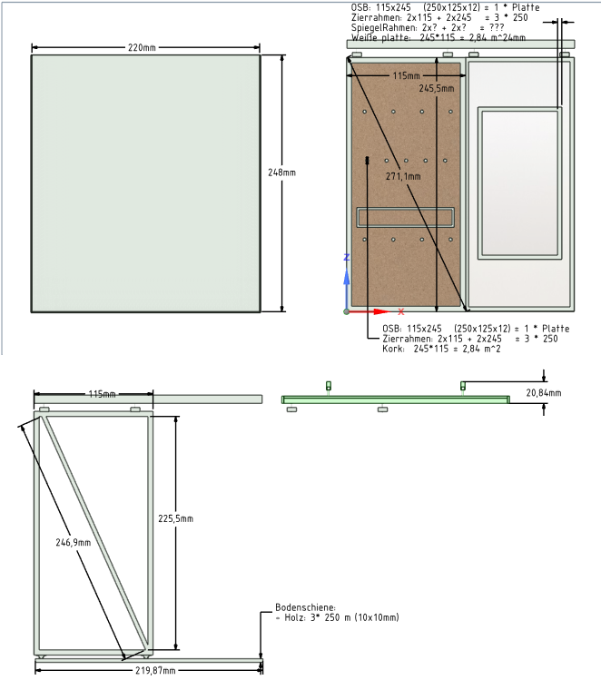|
| Photogrammetry Swing (AT Mega) | 08.02.2022 | |
| 3D Scan of an apple | 08.02.2022 | |
|  WorkBench  | 05.10.2020 | 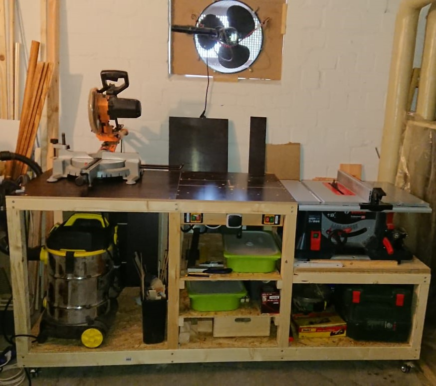| 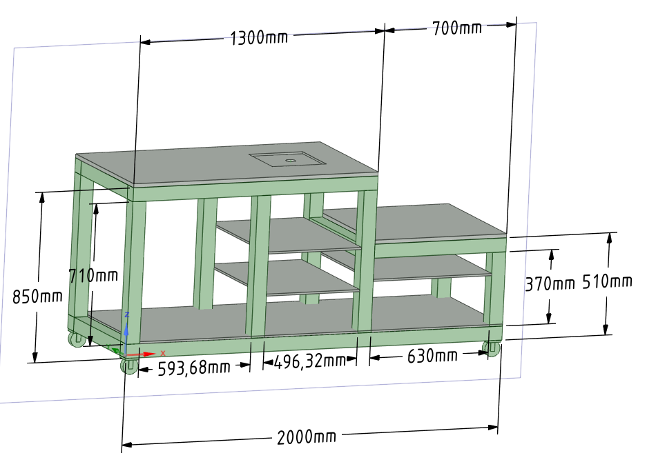|
| Elephant | 01.01.2020 | | |
|  Tooth brush stand  | 01.01.2018 | 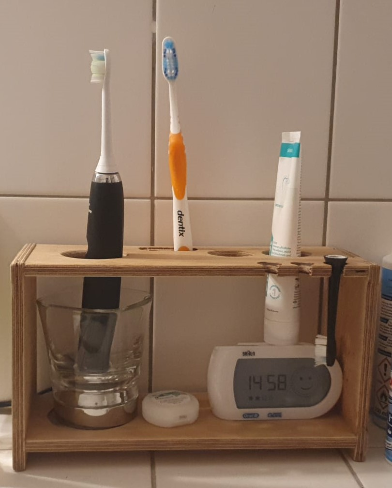| 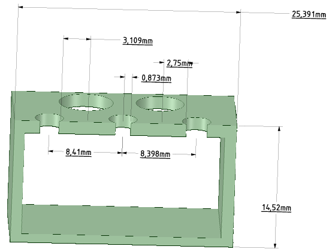|
|  Soundbox (Raspberry Pi & RFID) | 04.07.2016 | 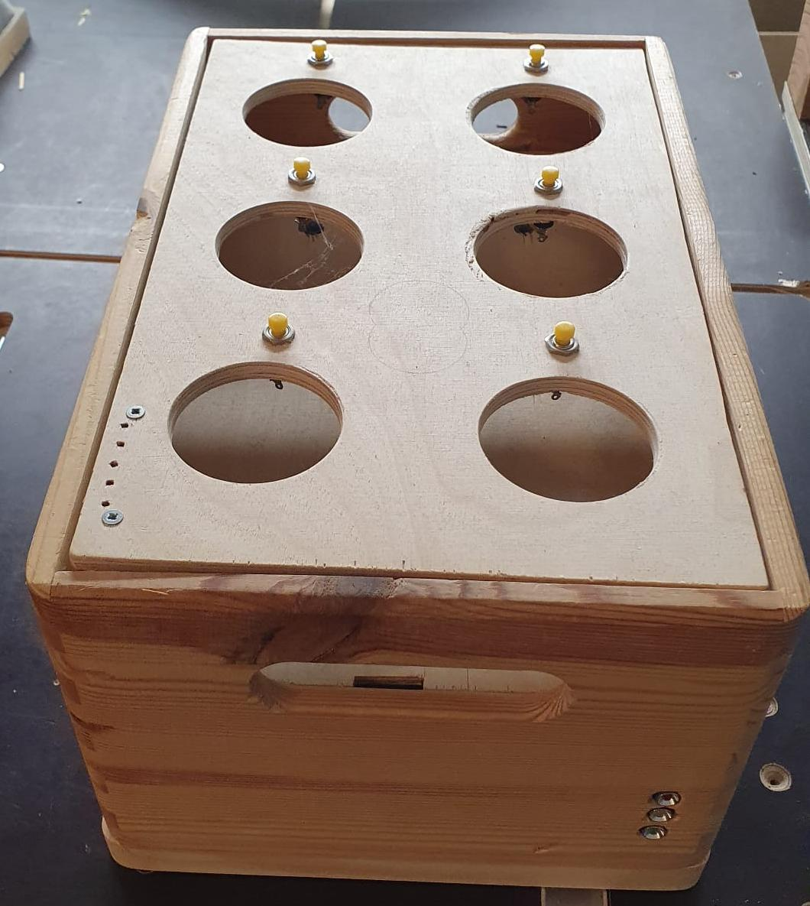| 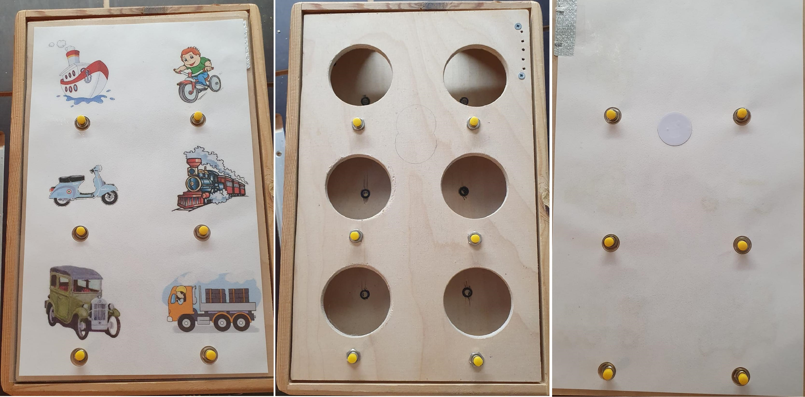|
| Common Rail Test Bench (PHD) | 10.12.2012 | 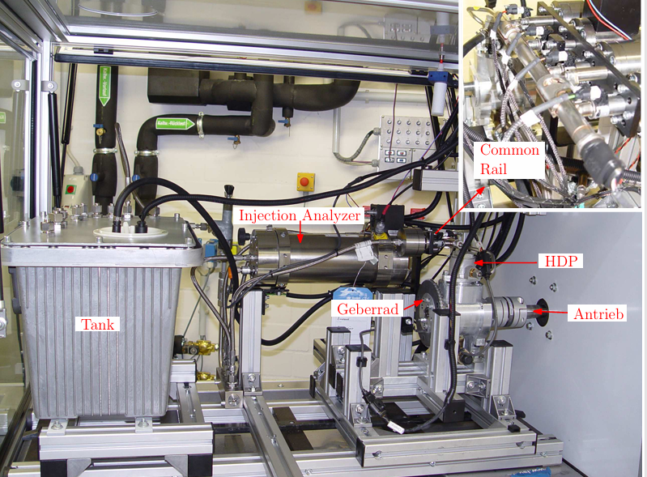|

