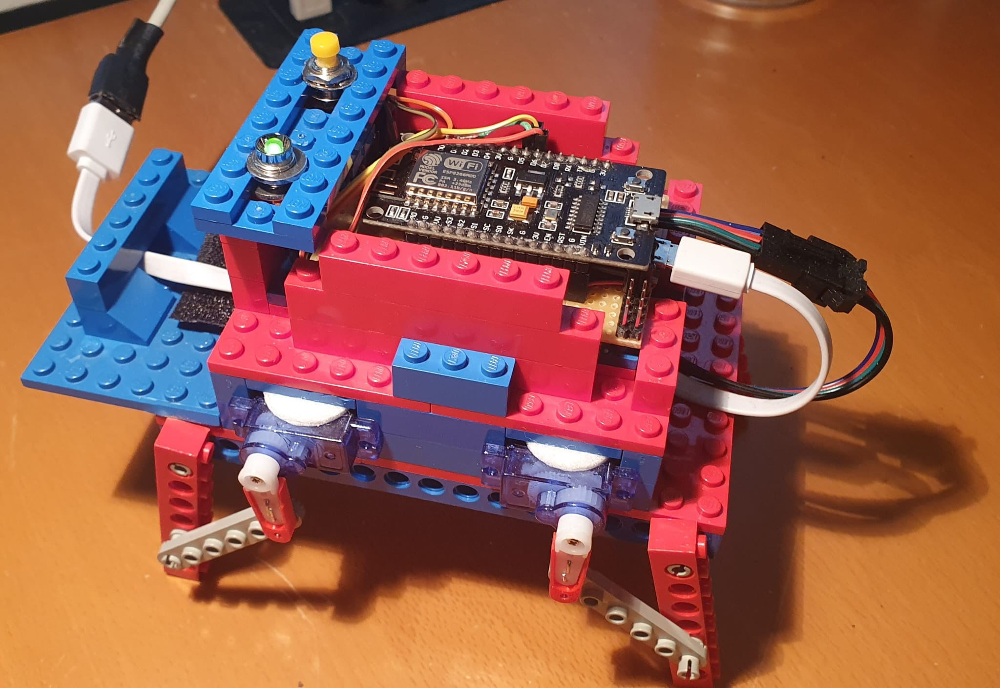
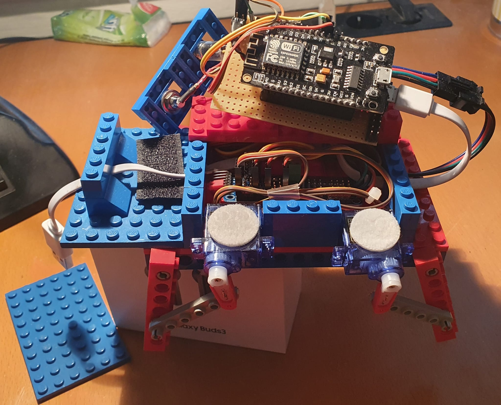

# Servo_Walker: 4-Leg Servo Gait with NodeMCU + PCA9685

`Servo_Walker` is a compact quadruped walker demo driven by an ESP8266 (NodeMCU) and a PCA9685 PWM servo controller.  
It supports two operating modes:

- **STAND**: all legs move to neutral pose
- **WALK**: continuous sinusoidal gait with phase-shifted leg motion

Mode switching is done with a push button, and an onboard LED indicates activity.

---

## Project Summary

|closed Lego structure| electronics inside the body |
|-|-|
|||

- **Controller**: ESP8266 NodeMCU
- **Servo driver**: PCA9685 (I2C)
- **Actuators**: 4 servos (one per leg in this version)
- **Control loop**: non-RTOS Arduino loop, angle-based gait generation
- **Operating modes**: STAND / WALK

This sketch is intentionally simple and easy to tune. The gait is generated from sine functions and phase offsets rather than inverse kinematics.

---

## Hardware

### Required components

- NodeMCU (ESP-12E / ESP8266)
- PCA9685 16-channel PWM servo board
- 4x RC servos
- Push button (mode change)
- LED + current-limiting resistor
- External 5V supply for servos (recommended)
- Common ground between NodeMCU and servo power

### Pin assignment (from sketch)

| Function | Symbol | Value |
|-|-|-|
| LED output | `IO_LED` | GPIO12 |
| Mode switch input | `IO_SW` | GPIO14 |
| Front-left leg PWM channel | `PWM_LEG_FRONT_LEFT` | 0 |
| Front-right leg PWM channel | `PWM_LEG_FRONT_RIGHT` | 3 |
| Rear-left leg PWM channel | `PWM_LEG_REAR_LEFT` | 4 |
| Rear-right leg PWM channel | `PWM_LEG_REAR_RIGHT` | 7 |

### I2C wiring

- PCA9685 `SDA` ↔ NodeMCU `SDA`
- PCA9685 `SCL` ↔ NodeMCU `SCL`
- PCA9685 `VCC` ↔ NodeMCU 3.3V (logic)
- PCA9685 `GND` ↔ NodeMCU GND
- Servo power to PCA9685 `V+` from external 5V source

> Use an external supply for servos. Do **not** power multiple servos from the NodeMCU USB rail.

---

## Software Behavior

### Startup

On boot, the sketch:

1. Starts serial output at `9600`
2. Configures button and LED pins
3. Initializes PCA9685 and sets PWM frequency to `400 Hz`

### Mode switching

- Button press toggles `_mode` between `0` and `1`
- `0` = STAND
- `1` = WALK
- A debounce-like delay (`500 ms`) is applied after detecting a press

### Gait generation

The active gait implementation is `walk2()`:

- Internal phase `_angle` increments by `_speed` each cycle
- Each leg receives a sine-derived angle with 90° phase offsets
- Per-leg offsets tune posture and stride balance
- Loop delay is `10 ms`

The older `walk()` method is still present as a simpler stepped gait but not currently used.

---

## Key Tuning Parameters

These constants/variables are the most useful to calibrate movement:

- `PWM_VALUE_MIN` / `PWM_VALUE_MAX`  
	Maps servo angle range to PCA9685 pulse values.
- `_speed`  
	Controls gait phase increment speed.
- Sine amplitude in `set_leg_angle2()` (currently `30.0`)  
	Controls swing amplitude.
- Per-leg offsets in `walk2()` (`+20`, `-20`, etc.)  
	Compensate mechanical asymmetry and neutral pose.

If a servo moves in the wrong direction, check the `inverted` flag used per leg.

---

## Build & Upload (Arduino IDE)

1. Open `Servo_Walker/Servo_Walker.ino`
2. Select board: `NodeMCU 1.0 (ESP-12E Module)`
3. Select the correct COM port
4. Compile and upload
5. Open serial monitor at `9600 baud`

Expected serial messages:

- `Walking Monster` on startup
- `Change Mode --> STAND` / `Change Mode --> WALK` on button toggles

---

## Dependencies

The project includes Adafruit PCA9685 driver files locally:

- `Adafruit_PWMServoDriver.h`
- `Adafruit_PWMServoDriver.cpp`

`library.properties` indicates dependency on:

- `Adafruit BusIO`

If your environment does not already provide it, install **Adafruit BusIO** via Library Manager.

---

## File Organization

- `Servo_Walker/Servo_Walker.ino` — main application logic (modes, gait, IO)
- `Servo_Walker/Adafruit_PWMServoDriver.h/.cpp` — PCA9685 driver implementation
- `Servo_Walker/library.properties` — library metadata and dependency hint
- `Documentation.md` — this documentation

---

## Known Limitations / Next Steps

**Current limitations**

- Open-loop gait only (no closed-loop stabilization or correction)
- No battery or supply-voltage monitoring
- Limited kinematics; walking direction is not yet controllable

**Next steps**
- Add configurable gait profiles (speed, amplitude, phase offsets)
- Improve the leg architecture using LEGO Technic parts to achieve a more realistic walking gait instead of a swimming-like motion
- Improve the leg-control strategy to produce more natural and stable motion
- Extend steering methods so the robot can control and change its walking direction
- Add IMU-based stabilization for improved balance on uneven surfaces

