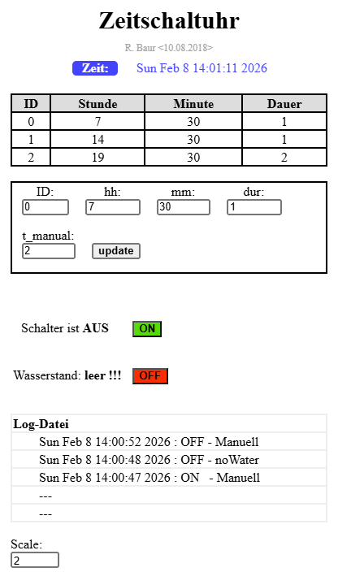
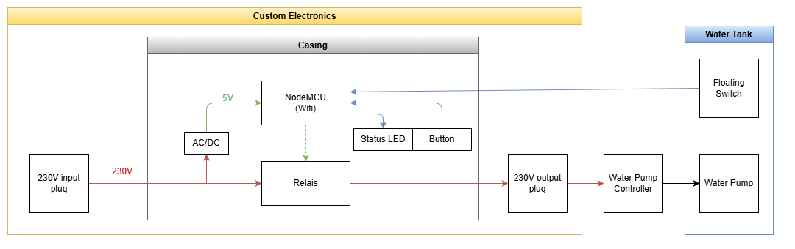
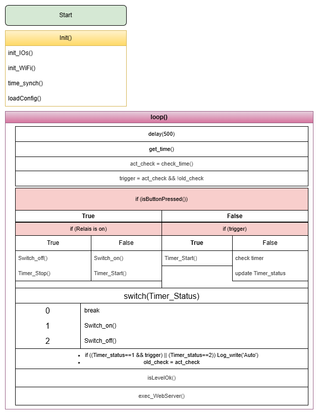
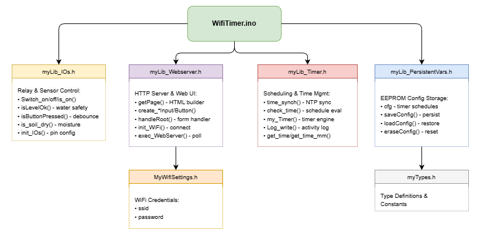

# WifiTimer: Timer-Based Power Supply with Web Server Configuration

## Project Summary

WifiTimer is a smart timer-based water pump controller built on the ESP8266 (NodeMCU). It combines automatic scheduling, manual control, and safety monitoring via a responsive web interface. The system can operate up to three independent timer schedules, with real-time adjustments stored persistently in EEPROM.

**Key capabilities:**
- **Scheduling**: Configure up to 3 independent timer events with custom start times and durations
- **Manual control**: Override via physical button or web UI on-off switches
- **Safety**: Automatic shutdown if water level drops; LED alerts for critical conditions
- **Monitoring**: Activity logging with timestamps; soil moisture sensing (optional)
- **Connectivity**: NTP-synchronized real-time clock; responsive web interface for remote configuration
- **Storage**: EEPROM-backed configuration—settings persist through power loss

**Architecture:**
The code is modular and organized into focused library headers: IO control, timer/scheduling, web UI, and persistent configuration storage.

---

## Configuration via Web Server

The web interface allows complete remote control and configuration:

- **Timer configuration**: Define up to three timer events with custom start times (HH:MM) and durations (minutes)
- **Manual timer**: Trigger a one-time run for a specified duration using the `t_manual` parameter
- **On/Off controls**: Virtual buttons in the web UI to instantly toggle the pump, independent of timers
- **Persistent storage**: Click the `update` button to save all settings to EEPROM; configuration survives power cycles
- **Activity log**: View the last 5 pump events (on/off/auto/manual) with timestamps

---

## Hardware

|Item|Type|Details
|-|-|-|
|NodeMCU | ESP-12E | [ESP8266 NodeMCU development board](https://de.wikipedia.org/wiki/NodeMCU) |
|Relais | SRD-05VDS-SL-C | [TRU COMPONENTS TC-9072472](https://www.conrad.de/de/p/tru-components-tc-9072472-relais-platine-1-st-passend-fuer-entwicklungskits-arduino-2268118.html?experience=b2c&hk=SEM&utm_source=google&utm_medium=cpc&utm_campaign=DE+-+PMAX+-+NonBrand+-+High&utm_id=22797105046&gad_source=1&gad_campaignid=22787577324&gbraid=0AAAAAD1-3H5OOKfC-F5dfbRnKc5PRWTL1&gclid=Cj0KCQiAhaHMBhD2ARIsAPAU_D79X5FOwd9OvRX2RuEP73A7cDPEYU_o6M82Y9xMd1_E_FBTGFRTCh4aAs1wEALw_wcB)  |
|Balcony Watering | Gardena Typ: 1407 | [230V Power supply for watering system](docu/Gardena.jpg)|
|AC/DC Converter | - | 230V ->5V 1A |
|Extension cable 230V| - | 3m; cut in the middle and connected to the relais|
|Moisture sensor | [Flying-Fish MH-Sensor](https://einstronic.com/product/soil-moisture-level-sensor-module/) | Optional, not yet integrated

### NodeMCU Pin Assignment

| Component | GPIO Pin | Notes |
|-|-|-|
| AC/DC Power | 5V, GND | Powers the NodeMCU board |
| Water level switch | D5, GND | Float switch with pull-up; LOW = water OK |
| Status LED | D4, GND | Active HIGH; includes current-limiting resistor |
| Relay module | D0, D1 | Controls pump; active LOW (inverted logic) |
| Moisture sensor | A0, 5V, GND | Analog input; not yet integrated |

---

## Structogram

The main program loop handles scheduling evaluation, manual button input, automatic timer control, and web server requests:

- **Source diagram** (editable): [structogram_WifiTimer.drawio](docu/structogram_WifiTimer.drawio) — Open in [draw.io](https://draw.io) to view or edit the control flow
- **Static view** (PNG): 

---

## File Organization

The diagram below shows the dependency relationships and key capabilities of each library header:

- **Source diagram** (editable): [file_dependencies.drawio](docu/file_dependencies.drawio) — Open in [draw.io](https://draw.io) to inspect or modify the architecture
- **Static view** (PNG): 

---

## Arduino IDE Setup

To build and upload this project, configure the Arduino IDE with these settings:

- **Board**: Tools → Board → esp8266 → NodeMCU 1.0 (ESP-12E Module)
- **CPU Frequency**: 80 MHz (default)
- **Upload Speed**: 115200 baud
- **Port**: Select your COM port

Refer to the screenshot below for visual reference:

---

## Header Files Reference

Each library header encapsulates a specific functional domain:
### myLib_IOs.h — Hardware I/O Control

Core functions for managing relays, sensors, and status indicators:

- **Relay control**: `Switch_on()`, `Switch_off()`, `Switch_is_on()` — manage the two relay outputs (active LOW)
- **Water level detection**: `isLevelOk()` — reads the float level switch and triggers automatic shutdown if water is low; blinks LED as warning
- **Soil moisture reading**: `is_soil_dry()` — acquires analog sensor value from A0 and computes percentage in `soilMoisturePercent` (not yet integrated into main logic)
- **Button input**: `isButtonPressed()` — debounced digital read of the external push-button with blocking debounce loop
- **Initialization**: `init_IOs()` — configures all GPIO pins, performs initial sensor reads, and sets safe defaults (relays off, LED off)

### myLib_Timer.h — Scheduling & Time Management

Time synchronization, schedule evaluation, and timer control:

- **NTP synchronization**: `time_synch()` — syncs system clock with `pool.ntp.org` at boot using the configured timezone
- **Time access**: `get_time()`, `get_time_mm()`, `print_time()` — retrieve current time as UNIX struct or minute-of-day integer
- **Schedule checking**: `check_time()` — evaluates whether the current time falls within any of the three configured timer windows
- **Timer engine**: `my_Timer()` — starts manual (duration-based) or automatic (schedule-based) timers and tracks expiration
- **Activity log**: `Log_write()` — circular FIFO log buffer (5 entries max) recording ON/OFF transitions with UTC timestamps
- **Helpers**: `set_start_min()`, `update_start_min()` — utility functions for timer schedule conversion and management

### myLib_Webserver.h — HTTP Server & Web UI

Builds and serves a responsive HTML interface for remote configuration and monitoring:

- **Form builders**: `create_NumberInput()`, `create_Button()`, `create_NumDropDown()` — generate reusable HTML input components with inline styling
- **Page generation**: `getPage()` — assembles the complete HTML document (headers, CSS, form controls, status displays, activity log) and returns as a single string
- **Request handlers**: `handleRoot()`, `handleB1()` — process incoming POST requests (timer updates, on/off commands, manual timer triggers)
- **Utilities**: `server_getInt()` — safely extract and convert integer parameters from HTTP request arguments
- **Initialization**: `init_WiFi()`, `exec_WebServer()` — establish WiFi connection and poll for incoming HTTP requests

### myLib_PersistentVars.h — Configuration Storage

Manages timer schedules and settings in persistent storage:

- **Configuration structure**: `cfg` — holds all user settings: three timer schedules (start hour, minute, duration per timer) and the manual timer duration
- **Persistence layer**: `saveConfig()`, `loadConfig()` — write configuration to and read from EEPROM
- **Reset function**: `eraseConfig()` — optional factory reset (clears all timers)

### MyWifiSettings.h — WiFi Credentials

User configuration file for network access:

- **Network credentials**: `ssid`, `password` — enter your WiFi network name and password here

---

## Quick Start Guide

1. **Update WiFi settings**: Edit `MyWifiSettings.h` and enter your network credentials
2. **Select board**: Arduino IDE → Tools → Board → NodeMCU 1.0 (ESP-12E Module)
3. **Upload**: Connect your NodeMCU via USB and click Upload
4. **Find the device**: After boot, the NodeMCU connects to your WiFi and displays its IP address on the serial monitor
5. **Open the web interface**: Enter the IP address in your browser (e.g., `http://192.168.1.100`)
6. **Configure timers**: Define your three timer schedules, set manual duration, and click "update" to save

**Default behavior**: On power-up, all relays are OFF. Timers activate only on schedule or by manual trigger via button/web UI.

---

