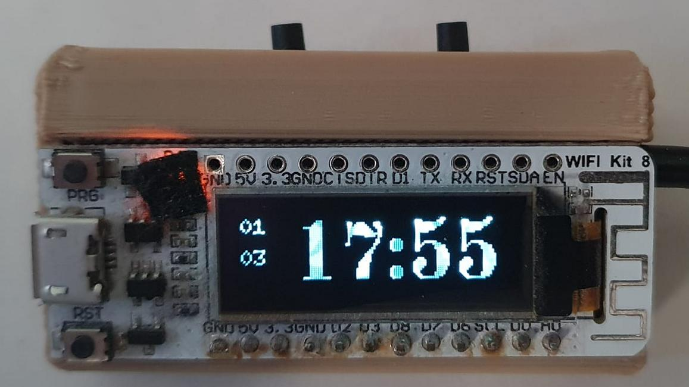
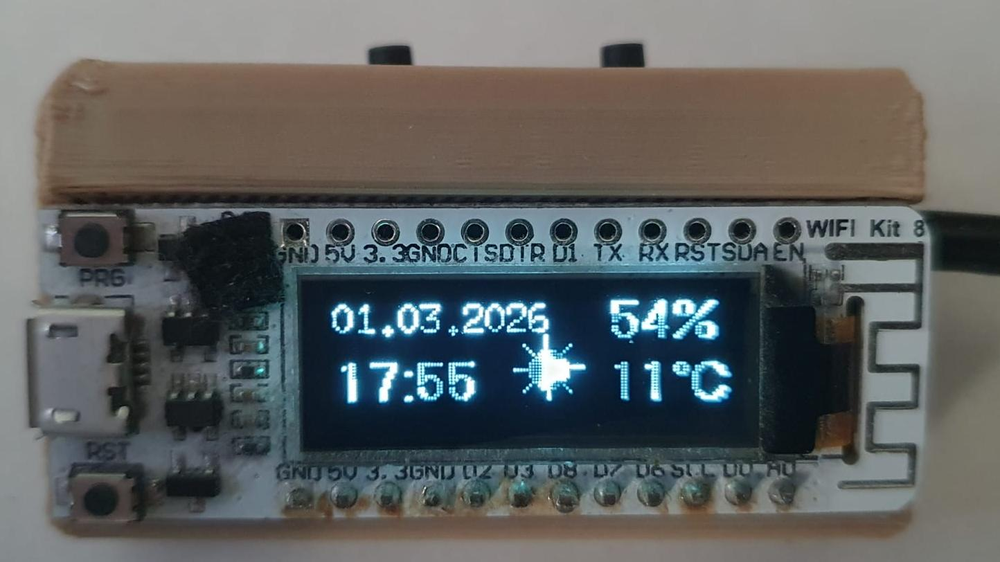
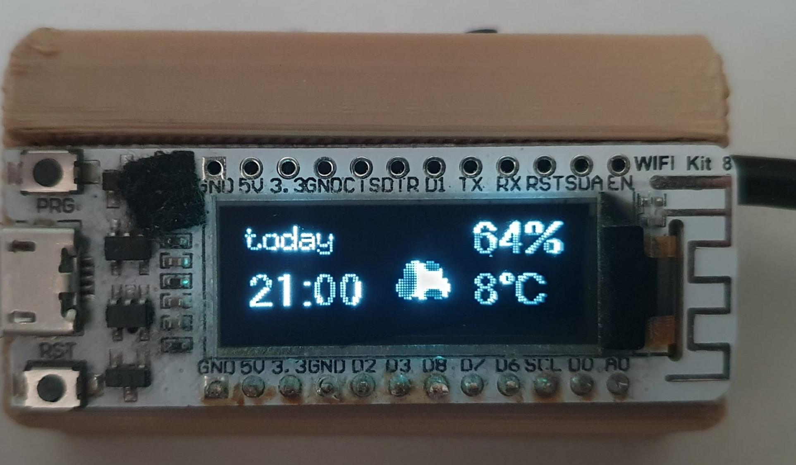

# WeatherClock: OLED Weather + Clock on ESP8266

`Weather.ino` is a compact ESP8266 weather clock that shows current time, forecast values, and temperature statistics on a 128x32 OLED.

The project combines:

- Wi-Fi connectivity
- NTP time synchronization
- OpenWeather forecast retrieval
- OLED UI pages controlled by buttons

|current time| current wheather | weather forcast (skipping 3 hours each 2 seconds)|
|-|-|-|
||||

---

## Project Summary

- **Controller**: ESP8266 NodeMCU
- **Display**: SSD1306 OLED, 128x32
- **Weather source**: OpenWeather `forecast` endpoint
- **UI model**: 4 display pages + button-driven page switching
- **Update cycle**: Weather refresh every 3 hours (checked once per minute)

---

## Features Implemented in `Weather.ino`

- Multi-page OLED interface:
  - Current weather (date/time, humidity, temperature, icon)
  - Forecast page (list entry by index)
  - Temperature statistics (`act`, `mean`, `max`)
  - Large digital clock page
- Button-controlled page cycling via `But_1`
- NTP-synced date/time formatting helpers
- Weather icon rendering (sun/cloud/rain) from forecast description text
- Startup weather fetch + periodic auto-refresh logic

---

## Hardware & Pin Assignment

### Buttons

From `Weather.ino` / `myLib_IOs.h`:

| Function | Symbol | Pin |
|-|-|-|
| Next page | `But_1` | `D7` |
| Reserved | `But_2` | `D8` |
| Summer-time mode input at startup | `But_3` | `D6` |

### OLED (U8g2 software I2C)

From `myLib_OLED.h` (`U8G2_SSD1306_128X32_UNIVISION_F_SW_I2C`):

- Clock: GPIO `5`
- Data: GPIO `4`
- Reset: GPIO `16`

---

## Software Architecture

`Weather.ino` includes focused modules:

- `myLib_WIFI.h` — Wi-Fi connection and IP startup logging
- `myLib_Timer.h` — NTP sync, date/time formatting, timezone handling
- `myLib_IOs.h` — button reading and basic IO setup
- `myLib_OLED.h` — display initialization and text drawing helpers
- `myLib_Weather.h` — OpenWeather HTTP request, JSON parsing, weather arrays, symbols

---

## Runtime Flow

### Setup sequence

1. `init_IOs()`
2. `init_WiFi()`
3. `init_OLED()`
4. `init_Timer()`
5. `init_Weather()`
6. Optional summer-time mode selection using `But_3`

### Loop behavior

- Main loop runs every 1 second (`delay(1000)`)
- `But_1` cycles through 4 menu pages (`menu_pages = 4`)
- Every 60 cycles (about 1 minute), `updateWeather()` is called
- `updateWeather()` triggers `getWeather()` when hour is divisible by 3 and minute is `0`

---

## Weather Data Pipeline

`myLib_Weather.h` performs:

1. Wi-Fi state diagnostics (`WiFi.status`, local IP, RSSI)
2. DNS resolution for `api.openweathermap.org`
3. TCP connect by resolved IP on port `80`
4. HTTP GET to `/data/2.5/forecast` with:
	- location (`q`)
	- API key (`appid`)
	- metric units (`units=metric`)
	- result count (`cnt = 8`)
5. JSON extraction into arrays (`temp`, `humidity`, `weather`, `daytime`, ...)
6. Calculation of summary values in `temp_stat`:
	- current
	- mean
	- max

---

## Secrets Setup

To keep credentials out of git, use a local secret header:

1. Create `NodeMCU/WeatherClock/Weather/MySettings.secret.h`
2. Add values:
	- `#define WIFI_SSID "..."`
	- `#define WIFI_PASSWORD "..."`
	- `#define OPEN_WEATHER_API_KEY "..."`
	- `#define OPEN_WEATHER_API_LOC "city,country"` (example: `"berlin,DE"`)
3. Build/upload as usual

`MySettings.h` enforces these symbols with compile-time checks (`#error`) if missing.

---

## Build & Upload (Arduino IDE)

1. Open `NodeMCU/WeatherClock/Weather/Weather.ino`
2. Select board: `NodeMCU 1.0 (ESP-12E Module)`
3. Select the correct COM port
4. Install required libraries (if not already present):
	- `ArduinoJson`
	- `U8g2`
5. Upload and open Serial Monitor (`115200 baud`)

---

## Display Pages

- **Mode 0**: `disp_Current()` — current date/time + weather symbol + humidity + temperature
- **Mode 1**: `disp_Weather(z)` — forecast slot display with date/time and weather values
- **Mode 2**: `disp_statistics()` — `act`, `mean`, `max` temperatures
- **Mode 3**: `disp_clock()` — large digital clock and date fragments

---

## Troubleshooting

If weather retrieval fails:

- Verify Wi-Fi is connected (`WiFi.status() == WL_CONNECTED`)
- Check DNS log output (`DNS ok=...`)
- Verify API key and location in `MySettings.secret.h`
- Ensure outbound access to OpenWeather from your network
- Confirm `ArduinoJson` and `U8g2` are installed in Arduino IDE

If clock/time is wrong:

- Check internet access for NTP (`pool.ntp.org`)
- Validate timezone/summer-time selection (`But_3` at startup)

---

## Known Limitations / Next Steps

- Uses HTTP on port 80 (could be migrated to HTTPS)
- JSON parsing is line-oriented and can be made more robust
- Forecast index handling/UI transitions can be expanded
- Additional weather condition icons can be added
