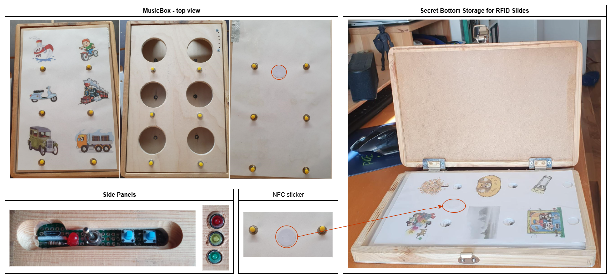
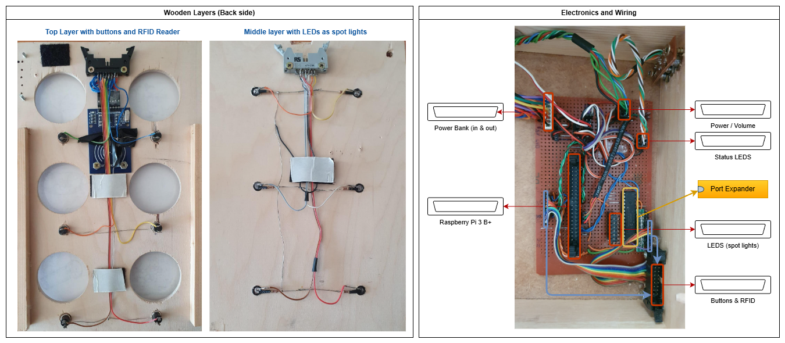
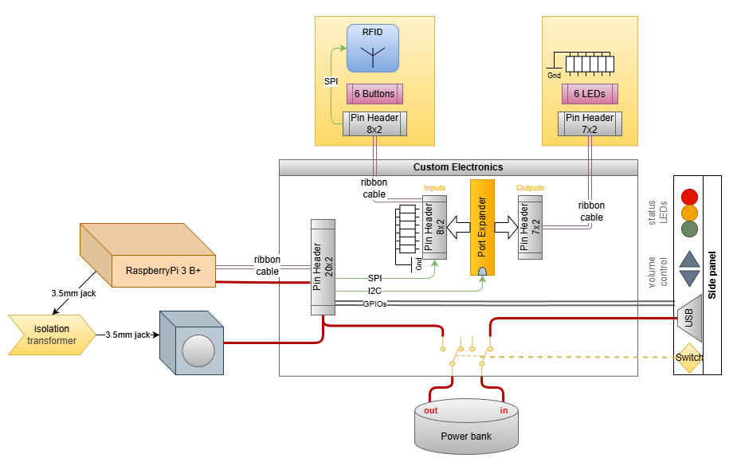

# Children's SoundBox with RFID tags and a port expander running on a Raspberry Pi

This project was developed in 2018 as a child-friendly audio box, conceptually similar to a Toniebox.
It is a wooden box with 6 buttons and RFID-based playlist selection:
- A card with a hidden RFID sticker is placed on top.
- The RFID ID selects one audio folder (playlist).
- The 6 physical buttons trigger up to 6 tracks from that folder.
- While a track is playing, the corresponding LED lights up like a spotlight.

The software is written in Python and runs on Raspberry Pi (tested on Raspberry Pi 3B/3B+).

## Final Product

The final build consists of stacked wooden layers and an internal electronics compartment. In the outside view, the documentation shows the MusicBox top view, the side panels, and a secret bottom storage area for RFID slides. It also highlights the NFC sticker placement used for playlist selection. The top layer contains the buttons and the RFID reader, while the middle layer holds the LEDs used as spot lights behind the picture windows. The inside view shows the complete electronics and wiring, including Raspberry Pi 3 B+, power bank input/output, power and volume wiring, status LEDs, and connectors for the buttons/RFID and LED assemblies.

## Hardware Setup

The following figure shows the hardware used in this project and the required wiring. To keep the setup flexible, I built a custom circuit board with sockets for ribbon cables, pin headers, and jumper wires. This allows me to run the SoundBox either from an internal power bank or from an external power supply. Furthermore, I can easily extend the circuit by adding additional GPIO signals.

| Part | Description |
| - | - |
| Raspberry Pi | 3B, 32 GB micro SD card |
| Port Expander | MCP23017-E/SP |
| RFID Reader | RC522 (mounted under wooden top layer) |
| LEDs | warm white (6x), each with 110 Ohm resistor |
| Buttons | 6x buttons (read through port expander) |
| Volume Buttons | 2x GPIO buttons (volume up/down) |
| Speakers | USB powered, 3.5 mm jack |
| Isolation Transformer | custom-built (2x jack sockets, 1:1 coils) |

### Hardware Roles

- `Raspberry Pi 3B`: runs the Python application, reads input hardware, and starts audio playback.
- `MCP23017 Port Expander`: provides additional digital I/O over I2C for button inputs and LED outputs.
- `RC522 RFID Reader`: reads NFC/RFID cards and provides the playlist ID.
- `6 Song Buttons`: each button corresponds to one track index in the currently selected playlist.
- `6 LEDs`: visual feedback for the active track (spotlight effect behind each picture).
- `2 Volume Buttons`: direct GPIO inputs for volume up/down.
- `Speakers`: output audio played by `mpg123`.
- `Isolation Transformer`: separates audio paths to reduce ground-loop noise/hum.

### Interfaces Used

- `SPI` (RC522): the RFID module is accessed via `/dev/spidev0.0`.
- `I2C` (MCP23017): the port expander uses address `0x20` on I2C bus `1` (fallback `0` in code).
- `GPIO` (direct):
  - status LED on board pin `7`
  - volume up on board pin `13`
  - volume down on board pin `11`
  - RC522 reset pin on board pin `22`

### Wiring Notes

- Enable both `SPI` and `I2C` in Raspberry Pi configuration before starting the app.
- The code uses `GPIO.BOARD` numbering, so physical pin numbers must match the definitions above.
- MCP23017 bank A is configured as outputs (LEDs), and bank B as inputs (buttons).
- Keep all button inputs stable (pull-up or pull-down per wiring design) to avoid false triggers.

***

## Setup Project on Raspberry Pi

### Prepare SD Card
- Install Raspberry Pi Imager: https://www.raspberrypi.com/software/
- Flash Ubuntu 64-bit to SD card.

### Software Setup
- Boot Raspberry Pi and complete initial setup.
- Copy the `Python` folder to the Raspberry Pi. (see: [GitHub/remkobaur/Public/MicroControllers/Python](https://github.com/remkobaur/Public/tree/main/MicroControllers/Python))
- Run installer script:
  - `chmod +x _Tools/install_python_ubuntu.sh`
  - `./_Tools/install_python_ubuntu.sh`

### Raspberry Pi Configuration
- Enable interfaces:
  - SPI
  - I2C
- Reboot Raspberry Pi.

### Install VS Code (Optional)
- `chmod +x _Tools/install_vscode_raspberrypi.sh`
- `./_Tools/install_vscode_raspberrypi.sh`

## Run Project

From folder `Python`:
- `source .venv/bin/activate`
- `python SoundBox/startme.py`

Alternative (direct main script):
- `python SoundBox/SoundBox-RFID.py`

## Configure Auto Start on Boot (Optional)

- `chmod +x _Tools/add_autostartCommands_to_bashrc.sh`
- `./_Tools/add_autostartCommands_to_bashrc.sh`

This script appends commands to `~/.bashrc`:
- activate virtual environment
- start `SoundBox/startme.py`

***

## Software Dependencies

From `requirements.txt`:
- `mutagen`
- `RPi.GPIO`
- `spidev`

Required OS packages on Raspberry Pi:
- `python3-smbus`
- `python3-cwiid`
- `python3-alsaaudio`
- `python3-spidev`
- `mpg123`
- `alsa-utils`

Used features:
- `mpg123` (or fallback player): audio playback
- `alsaaudio`: mixer volume control
- `mutagen.mp3`: MP3 duration detection
- `spidev`: RC522 SPI communication
- `smbus`: MCP23017 I2C communication

## Runtime Entry Point

Primary entry point:
- `SoundBox/startme.py`

`startme.py`:
- Resolves project root dynamically.
- Activates `.venv` in a bash subshell.
- Starts `SoundBox/SoundBox-RFID.py`.

Main app script:
- `SoundBox/SoundBox-RFID.py`

## High-Level Runtime Flow

1. `startme.py` starts the app in the project virtual environment.
2. `SoundBox-RFID.py` configures flags and paths in `MyToolBox`.
3. `Config.json` is loaded to map RFID IDs to subfolders.
4. Hardware classes initialize (GPIO, MCP23017, RC522).
5. Main loop runs continuously:
   - Check for RFID card changes.
   - Refresh playlist if a new card is detected.
   - Read button presses.
   - Toggle play/stop for selected song.
   - Update LED state based on active song.
   - Process volume up/down buttons.

## Configuration Model

Main configuration file:
- `SoundBox/Files/Sounds/Config.json`

Structure:
- Root key: `Sounds`
- Each entry contains:
  - `ID`: integer read from NFC block 8 byte 0
  - `Subfolder`: folder name under `SoundBox/Files/Sounds`
  - `Sounds`: informational list of expected files

Example mapping:
- `ID=1 -> Sounds1`
- `ID=2 -> Sounds2`
- `ID=3 -> Sounds3`
- `ID=4 -> Sounds4`

Important behavior:
- Runtime playback list is built from actual files in the selected folder.
- Files are filtered to `.mp3` and `.wav` and sorted alphabetically.
- Button index `0..5` maps to playlist position `0..5`.

## Audio File Layout

Expected root:
- `SoundBox/Files/Sounds/`

Each RFID playlist points to one subfolder (for example `Sounds1`).
Inside each subfolder:
- Place audio files (`.mp3`, `.wav`).
- Naming affects order because sort is alphabetical.

Recommendation:
- Use numeric prefixes for deterministic ordering, for example:
  - `01_intro.mp3`
  - `02_song.mp3`

## Python Module Documentation (Full)

### `SoundBox/startme.py`
Purpose:
- Launch helper for runtime startup.

Key behavior:
- Computes project root from script location.
- Uses `.venv/bin/activate`.
- Runs `python SoundBox/SoundBox-RFID.py` via `bash -c`.

### `SoundBox/SoundBox-RFID.py`
Purpose:
- Main application loop.

Key behavior:
- Creates `MyToolBox` instance.
- Enables RFID selection and port expander mode.
- Loads playlist mapping from `Config.json`.
- Sets default chart (`ID=1`) and volume.
- In loop, processes RFID changes, button presses, lights, and volume.

### `SoundBox/_Classes/MyToolBox.py`
Purpose:
- Central composition root that ties all hardware and logic classes together.

Contains:
- `CL_GPIO` instance for status LED and volume buttons.
- `CL_PortExpander` for button/LED matrix via MCP23017.
- `CL_MusicBox` for playback and volume handling.
- `CL_RFID` and `CL_NFC` for RC522 access.

Key methods:
- `check_update_new_slide()`: detect new RFID card and refresh playlist.
- `check_song_button_press()`: read active song button.
- `control_Lights()`: active LED while playback runs.
- `update_Volume()`: poll volume GPIO buttons.

### `SoundBox/_Classes/CL_MusicBox.py`
Purpose:
- Audio playback, playlist management, and mixer volume control.

Key features:
- Dynamic ALSA mixer discovery (`PCM`, `Master`, plus auto-discovered mixers/cards).
- Player discovery (`mpg123`, fallback `mpg321`, fallback `ffplay`).
- Config-driven folder mapping via `import_jsonConfigFile()`.
- Playlist refresh with sorted `.mp3`/`.wav` files.
- Track toggle behavior: pressing same button stops current track.

Important methods:
- `refresh_PlayList(ID)`
- `play_song(IND)`
- `stop_music()`
- `is_playing()`
- `set_volume()` / `volume_plus()` / `volume_minus()`

### `SoundBox/_Classes/CL_GPIO.py`
Purpose:
- Direct Raspberry Pi GPIO handling.

Used for:
- Status LED (`pin 7`).
- Legacy barcode input pins.
- Volume up/down buttons (`pin 13`, `pin 11`).

### `SoundBox/_Classes/CL_PortExpander.py`
Purpose:
- MCP23017 I2C driver for reading 6 song buttons and controlling LEDs.

Key behavior:
- Tries I2C bus 1, then bus 0.
- Configures bank A as outputs (LEDs), bank B as inputs (buttons).
- Handles active bit detection (`get_activ_bit()`).
- Supports light control helpers (`all_lights_on/off`, blink).

### `SoundBox/_Classes/CL_NFC.py`
Purpose:
- RC522 low-level NFC/RFID operations plus helper methods for ID read/write.

Key behavior:
- SPI register-level communication.
- Request, anticollision, select, authenticate, read/write block.
- `NFC_set_ID(ID)`: writes ID into block 8 (byte 0, rest zero).
- `NFC_get_ID()`: reads ID from block 8.

### `SoundBox/_Classes/CL_RFID.py`
Purpose:
- Nearly identical RC522 implementation used by existing toolbox flow.

Note:
- Functionality overlaps heavily with `CL_NFC.py`.
- Kept for compatibility with existing project code.

### `SoundBox/_Classes/MFRC522Edit.py`
Purpose:
- Older RC522 class used by maintenance/tag tool scripts.

### `SoundBox/_Classes/spi.py`
Purpose:
- Compatibility shim for legacy `spi` API using modern `spidev`.

Exposed API:
- `openSPI(device, speed)`
- `transfer(data)`
- `closeSPI()`

### `SoundBox/_Classes/CL_WiiMote.py`
Purpose:
- Legacy optional Wiimote input support.

Status:
- Not used by current main runtime.
- Contains Python 2 style print statements.

### Tag Utility Scripts (`SoundBox/RFID_TagTools`)

#### `NFC_Read.py`
- Reads card UID and data from sector/block 8.
- Prints detected card ID (`NFC_get_ID()`).

#### `NFC_Write.py`
- Prompts for numeric ID.
- Writes ID to card via `NFC_set_ID()`.
- Reads back for verification.

#### `RFID-Read-Data.py`
- Uses `MFRC522Edit` to authenticate and dump block 8 data.

#### `RFID-Write-Data.py`
- Prompts for numeric ID.
- Writes repeated value to all 16 bytes in block 8.
- Reads back and prints verification data.

## RFID Data Convention

The main app expects playlist ID in:
- RC522 MIFARE block `8`, byte `0`

Behavior in runtime:
- App reads block 8.
- `ID = BackData[0]`
- `ID` maps to subfolder via `Config.json`.

Default key used by tools/classes:
- `[0xFF, 0xFF, 0xFF, 0xFF, 0xFF, 0xFF]`

## Bash Scripts

### `_Tools/install_python_ubuntu.sh`
Purpose:
- Installs Python toolchain.
- Installs OS packages from apt hint in `requirements.txt`.
- Creates `.venv` with `--system-site-packages`.
- Installs pip dependencies.
- Validates imports and `mpg123` availability.

### `_Tools/install_vscode_raspberrypi.sh`
Purpose:
- Installs VS Code (`code` or fallback `code-oss`).

### `_Tools/add_autostartCommands_to_bashrc.sh`
Purpose:
- Makes `SoundBox/startme.py` executable.
- Adds startup lines to current user's `~/.bashrc`.

## Known Notes

- Volume control depends on available ALSA mixer; `CL_MusicBox` auto-discovers mixers/cards.
- `NFC_Write.py` and `RFID-Write-Data.py` still use `raw_input` (Python 2 style), so use Python 2 or adapt to `input()` for Python 3.
- `CL_WiiMote.py` is legacy and currently not part of the active app flow.