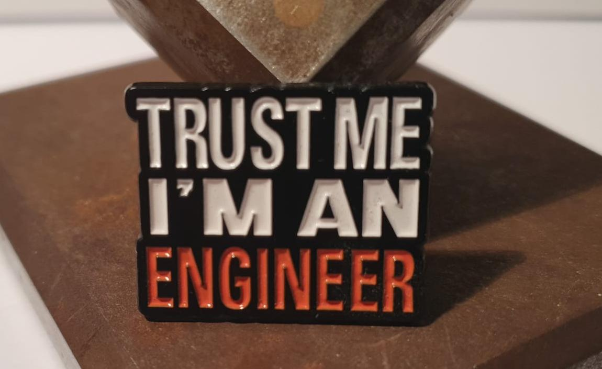

# Public
Documentation of Public Repository of Remko Baur
- [github documentation pages (html)](https://remkobaur.github.io/Public)

I have only recently started documenting my projects, so the project overview presented here is not yet complete.

## Content
| Section | Summary |
|---|---|
| [Crafting Projects](Craft-Projects/README.md) | This section contains documented hands-on projects from woodworking, electronics, and 3D printing, including photos, sketches, and short project notes. It serves as a curated overview of practical builds with a focus on recent work. |
| [Micro Controller](MicroControllers/README.md) | This section documents microcontroller-based projects, with a focus on ESP8266/NodeMCU implementations. It includes hardware setup information, configuration notes, and project-specific technical documentation. |
| [Unity](Unity/HouseBuilder/Documentation/README.md) | This section provides documentation for the Unity HouseBuilder tooling, including editor workflows, JSON import/export concepts, and feature-oriented module descriptions. It also includes visual result snapshots from ongoing development. |