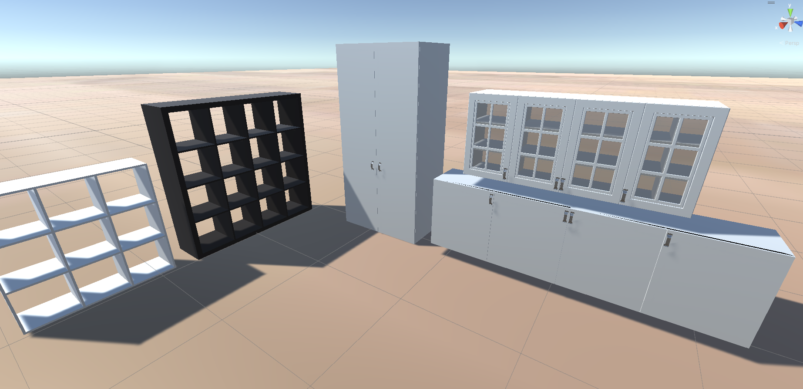
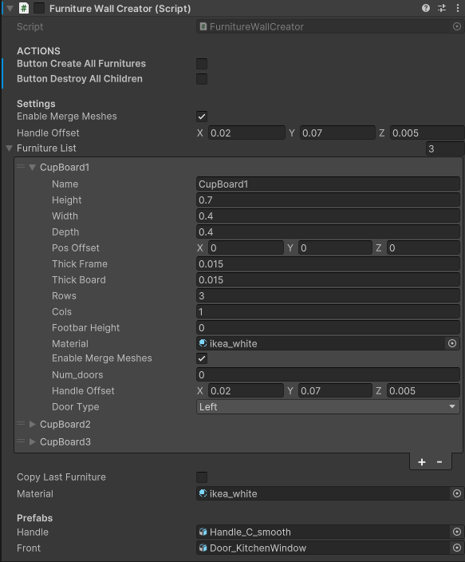

# FurnitureWallCreator

## Overview
`FurnitureWallCreator` is an editor-friendly Unity component that instantiates a wall of furniture items (`Cl_Furniture`) as child GameObjects. It supports batching creation via an inspector toggle, optional mesh merging (delegated to `FurnitureCreator`), and a quick example list generator. The component runs in edit mode and reacts to boolean flags in the inspector.

Script location: [Unity/HouseBuilder/Assets/Scripts/Furnitures/FurnitureWallCreator.cs](../Assets/Scripts/Furnitures/FurnitureWallCreator.cs)

## Quick start
1. Add `FurnitureWallCreator` to a GameObject in your scene.
2. Assign `material`, `handle`, and `front` prefabs in the inspector.
3. Populate `furnitureList` or use `create_example_list()` from the inspector (see Actions).
4. Toggle `ButtonCreateAllFurnitures` to generate the wall of furniture.

## Example Result:

## Inspector fields

- Actions
  - `ButtonCreateAllFurnitures`: Builds all furniture in `furnitureList` under a new `FurnCuster` child.
  - `ButtonDestroyAllChildren`: Removes all children under the current GameObject.
- Settings
  - `enableMergeMeshes`: Passed to each `FurnitureCreator` and `Cl_Furniture` for mesh merging.
  - `handleOffset`: Default handle offset for each furniture item.
  - `furnitureList`: List of `Cl_Furniture` instances to create.
  - `copyLastFurniture`: Adds a copy of the last list entry to `furnitureList`.
  - `material`: Default material applied to each furniture item.
- Prefabs
  - `handle`: Handle prefab for doors.
  - `front`: Front panel prefab.

## Actions and behavior
- Update loop: `Update()` checks inspector flags every frame (including edit mode).
- Create all furnitures
  - Creates a parent GameObject named `FurnitureCluster` under this component.
  - For each `Cl_Furniture`, it creates a `FurnitureCreator` component and a child `furnGO` GameObject.
  - Positions each child along the local Z axis, using each furniture width and `posOffset`.
- Copy last furniture
  - Adds a duplicate of the last `Cl_Furniture` entry to the list.
  - Note: this is a shallow copy if `Cl_Furniture` contains reference types.
- Destroy all children
  - Calls `Cl_MyMaster.destroyAllChildren(gameObject)`.

## Example list
`create_example_list()` clears the current list and adds three sample cabinets with basic dimensions, door type, rows, and columns. This is useful for quickly testing layout and prefab wiring.

## FurnitureCreator (brief)
`FurnitureCreator` builds a single furniture item from a `Cl_Furniture` definition. It runs in edit mode and uses inspector booleans to trigger actions.

Script location: [Unity/HouseBuilder/Assets/Scripts/Furnitures/FurnitureCreator.cs](../Assets/Scripts/Furnitures/FurnitureCreator.cs)

- Actions: `ButtonCreateShelf` creates or reuses `furnGO`, calls `construct_shelf()`, then `create_furniture()`.
- ButtonCreateExamples: triggers `init_furniture()` to load the selected `Template` into the `furniture` definition.
- Materials: `material` sets the default board material; `updateMaterials` pushes materials into `SetMaterialForAllChilds` components under the object.
- JSON: `ButtonJsonExport` writes `Cl_Furniture` to `StreamingAssets/json`, `ButtonJsonImport` loads it back.
- Templates: `Template` + `init_furniture()` populate common sizes like `Kallax_2x2` and `Pax_1mx2m`.
- Mesh merging: `enableMergeMeshes` toggles `MeshCombiner.Execute` on the generated furniture.

Template list (`E_Furniture`):
- `Expedit_4x4`
- `Kallax_2x2`
- `Kallax_4x4`
- `Pax_1mx2m`
- `Shelf_3x3`
- `Kitchen_80x70`
- `Kitchen_40x70`
- `Kitchen_60x70`

## Related scripts and types
- `Cl_Furniture` (furniture data)
- `FurnitureCreator` (builds a single furniture GameObject)
- `Cl_MyMaster` (hierarchy utilities)

Related folder: [Unity/HouseBuilder/Assets/Scripts/Furnitures](../Assets/Scripts/Furnitures)

## Notes
- The component uses `[ExecuteInEditMode]`, so actions can run without Play mode. 
- The parent name is `FurnitureCluster`. If you need a different name, adjust the source.
- Because actions run in edit mode, consider clearing generated objects before saving the scene if needed.
