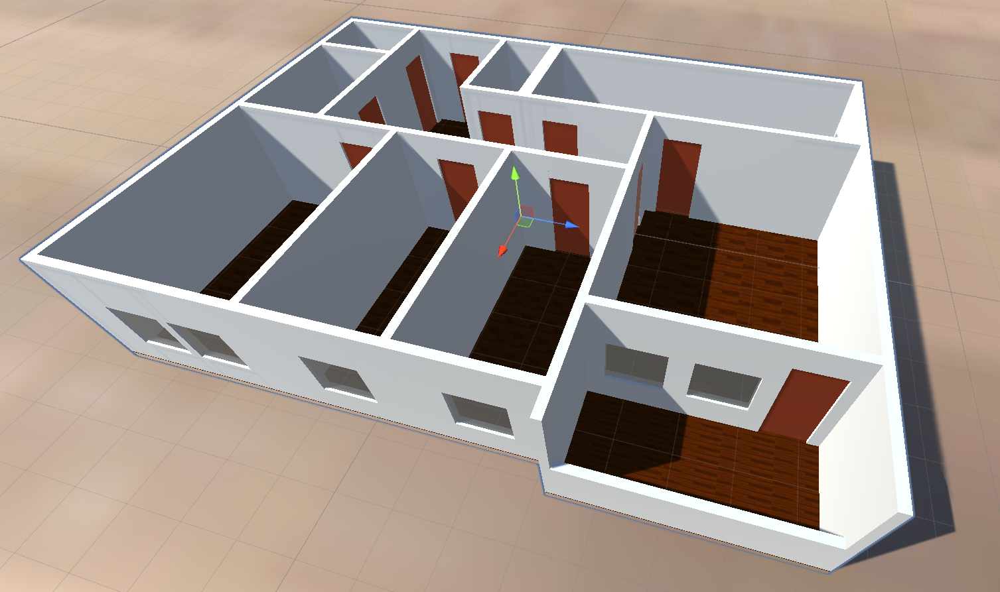
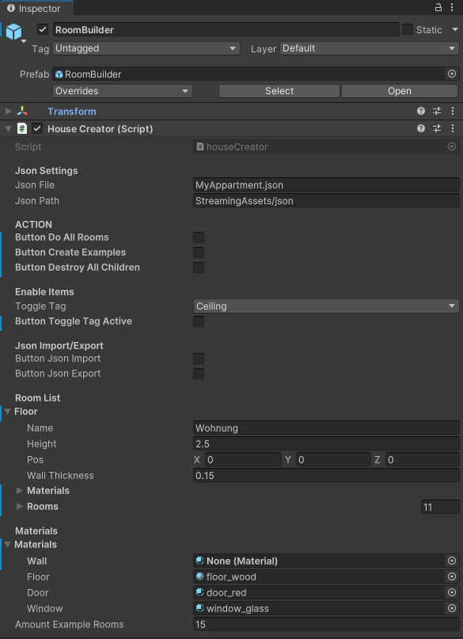
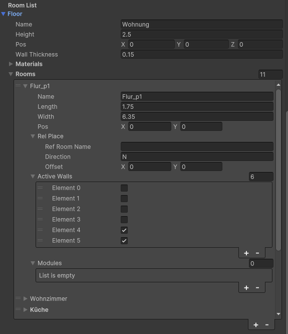

# HouseBuilder module (houseCreator)

## Overview
The `houseCreator` component is an editor-friendly Unity module that builds a floor layout from data (`Cl_Floor` and `Cl_Room`), can import and export JSON, generates example layouts, and toggles visibility of tagged sub-objects. It runs in edit mode and reacts to inspector "button" booleans that are reset after each action.

Script location: [Unity/HouseBuilder/Assets/Scripts/HouseBuilder/houseCreator.cs](../Assets/Scripts/HouseBuilder/houseCreator.cs)

## Example Result:

## Quick start
1. Add `houseCreator` to a GameObject in your scene.
2. Assign a `C_Materials` instance to `materials` in the inspector.
3. Set `jsonFile` and `jsonPath` (relative to `Assets`).
4. Use the inspector booleans to run actions (see below).

## Inspector fields

|HouseBuilder| Rooms|
|-|-|
| | |

- Json Settings
  - `jsonFile`: File name used for import/export, default `Floor.json`.
  - `jsonPath`: Relative folder under `Assets`. Default `StreamingAssets/json`.
- Action toggles
  - `ButtonDoAllRooms`: Builds all rooms for the current `floor`.
  - `ButtonCreateExamples`: Clears the floor, initializes, and generates an example apartment layout.
  - `ButtonDestroyAllChildren`: Destroys all children of the GameObject.
- Enable Items
  - `ToggleTag`: One of `ceiling`, `door`, `window`.
  - `ButtonToggleTagActive`: Toggles active state of tagged objects under this GameObject.
- Json Import/Export
  - `ButtonJsonImport`: Clears and loads the floor from JSON.
  - `ButtonJsonExport`: Writes the current floor to JSON.
- Room List
  - `floor`: The `Cl_Floor` data structure (rooms, height, wall thickness, etc.).
- Materials
  - `materials`: The `C_Materials` data used during generation of walls, floor, windows, and doors

## Actions and behavior
- Update loop: `Update()` calls `ButtonActions()` every frame (including edit mode). Each action resets its boolean to `false` after running.
- Build all rooms: `ButtonDoAllRooms` calls `floor.create(gameObject)` to generate geometry.
- Toggle tag visibility: `ButtonToggleTagActive` uses `Cl_MyMaster.findChildrenByTagMultiLevel(tag, gameObject, 5)` and toggles `SetActive` for each match.
- Import JSON: `ButtonJsonImport` clears the floor and loads JSON from disk.
- Export JSON: `ButtonJsonExport` writes the current floor data as JSON.
- Create example: `ButtonCreateExamples` clears, initializes, then creates a sample apartment with multiple rooms.
- Destroy children: `ButtonDestroyAllChildren` calls `Cl_MyMaster.destroyAllChildren(gameObject)`.

## JSON import and export

The full house configuration can be imported and exported via json files:
- Export uses `JsonUtility.ToJson(floor, true)`.
- Import uses `JsonUtility.FromJson<Cl_Floor>(jsonText)`.
- Path resolution is based on `Application.dataPath`, `jsonPath`, and `jsonFile`.
- Make sure your folder exists under `Assets` (for example, `Assets/StreamingAssets/json`).

## Example layout
`createExampleList()` generates a multi-room apartment, including:
- Flur_p1 (hallway)
- Wohnzimmer (living room)
- Kueche (kitchen)
- Balkon (balcony)
- Arbeitszimmer (office)
- Kinderzimmer (kids room)
- Schlafzimmer (bedroom)
- Bad (bathroom)
- Kammer (storage)
- Flur_p2 (hallway)
- Gaeste-WC (guest WC)

These rooms use `Cl_Room.place(...)` and add doors, windows, and wall modules to demonstrate the layout features.

## Cl_Room (data model)
`Cl_Room` defines a single room's size, position, and wall openings. It lives in [Unity/HouseBuilder/Assets/Scripts/HouseBuilder/Cl_HouseObjectClasses.cs](../Assets/Scripts/HouseBuilder/Cl_HouseObjectClasses.cs).

- Core fields: `name`, `length`, `width`, and `pos` (2D floor position).
- Wall control: `activeWalls` is a 6-element array for N, S, W, E, ceiling, and floor walls.
- Openings and fixtures: `modules` holds `WallModule` entries for doors, windows, holes, and lights.
- Relative placement: `relPlace` stores `refRoomName`, `direction`, and `offset` used by `place(...)`.
- Convenience methods: `addDoor`, `addWindow`, and `addLight` add standard-sized modules.
- Placement directions: `place(...)` accepts N, S, W, E, NE, NW, SE, SW, and edge-aligned variants EN, WN, ES, WS.

## Related scripts and types
The component depends on types defined elsewhere in the HouseBuilder scripts, including:
- `Cl_Floor`, `Cl_Room`, `C_Materials`, `WallModule`, and `ModuleType` (data and generation)
- `Cl_MyMaster` (hierarchy utilities)

Relevant script folder: [Unity/HouseBuilder/Assets/Scripts/HouseBuilder](../Assets/Scripts/HouseBuilder)

## Notes
- The component uses `[ExecuteInEditMode]`, so actions can run without Play mode.
- Ensure the tags `ceiling`, `door`, and `window` exist in the project Tag Manager.
- The current example layout uses fixed dimensions and names; adjust `createExampleList()` for custom templates.
