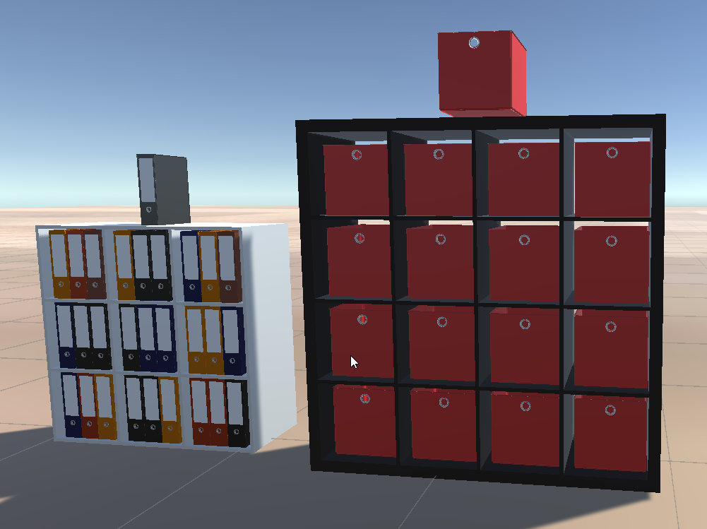

# Item Modification scripts

## Overview
This folder contains small editor-friendly utilities for duplicating objects, changing materials, and combining meshes at edit time.

Folder: [Unity/HouseBuilder/Assets/Scripts/ItemModificator](../Assets/Scripts/ItemModificator)

## Results

- left shelf: uses component **DuplicatorGrid** for cloning one folder, change its color and place it at given grid points
- right shelf: uses component **ItemMultiplicatorGrid** for cloning one box and place it at given grid points

## ClusterCombiner
File: [Unity/HouseBuilder/Assets/Scripts/ItemModificator/ClusterCombiner.cs](../Assets/Scripts/ItemModificator/ClusterCombiner.cs)

- Purpose: Find all children with a given tag and attach `MeshCombiner` to each to merge tagged meshes.
- Inspector controls: `Execute`, `ClusterTag`, `MeshTags`, `removeEmptyChildren`, `attachRemainingSubChildren`.
- Behavior: On `Execute`, finds children by tag, adds `MeshCombiner`, configures it, and triggers `Execute` on each combiner.

## DuplicatorGrid
File: [Unity/HouseBuilder/Assets/Scripts/ItemModificator/DuplicatorGrid.cs](../Assets/Scripts/ItemModificator/DuplicatorGrid.cs)

- Purpose: Clone an object into a stacked grid and optionally vary materials.
- Key settings: `block_amount`, `rows`, `columns`, `delta_x`, `delta_y`, `delta_z`, `obj_dx`, `obj_dz`.
- Material options: `change_materials`, `childName`, `mix_type` (rows, cols, stack, mixed), `myMaterials`.
- Behavior: Runs `create_clones()` in `Start()`; can skip the first clone to keep the original.

## ItemMultiplicatorGrid
File: [Unity/HouseBuilder/Assets/Scripts/ItemModificator/ItemMultiplicatorGrid.cs](../Assets/Scripts/ItemModificator/ItemMultiplicatorGrid.cs)

- Purpose: Simple grid duplicator for a single prefab.
- Key settings: `rows`, `columns`, `delta_x`, `delta_y`, `delta_z`.
- Behavior: Instantiates a grid of `Box` in `Start()` and parents clones to the current GameObject.

## MeshCombiner
File: [Unity/HouseBuilder/Assets/Scripts/ItemModificator/MeshCombiner.cs](../Assets/Scripts/ItemModificator/MeshCombiner.cs)

- Purpose: Merge meshes and colliders of child objects that match tag filters.
- Inspector controls: `Execute`, `FilterTags`, `ParentGO`, `destroyChildren`, `attachRemainingSubChildren`, `removeEmpty`.
- Behavior: On `Execute`, it moves to origin, combines meshes and colliders, removes or deactivates children, optionally attaches remaining sub-children, and cleans empty nodes.
- Notes: Uses `Mesh.CombineMeshes` and preserves materials across submeshes. Disables itself after running.

## MeshCompiner_ExecuteAll
File: [Unity/HouseBuilder/Assets/Scripts/ItemModificator/MeshCompiner_ExecuteAll.cs](../Assets/Scripts/ItemModificator/MeshCompiner_ExecuteAll.cs)

- Purpose: Trigger `Execute` on all `MeshCombiner` instances in the scene.
- Behavior: On `Execute`, finds all `MeshCombiner` objects with `FindObjectsOfType` and sets their `Execute` flag.

## SetMaterialForAllChilds
File: [Unity/HouseBuilder/Assets/Scripts/ItemModificator/SetMaterialForAllChilds.cs](../Assets/Scripts/ItemModificator/SetMaterialForAllChilds.cs)

- Purpose: Update materials for boards, doors, and handles under a target object.
- Inspector controls: `materialBoards`, `materialDoor`, `materialHandle`, `Execute`.
- Behavior: On `Execute`, finds children by tags (`board`, `door`, `handle`) and applies materials. Also updates the MeshRenderer materials on the root.
- Namespace note: This script is in `My.ns_Furniture` even though it sits in ItemModificator.
