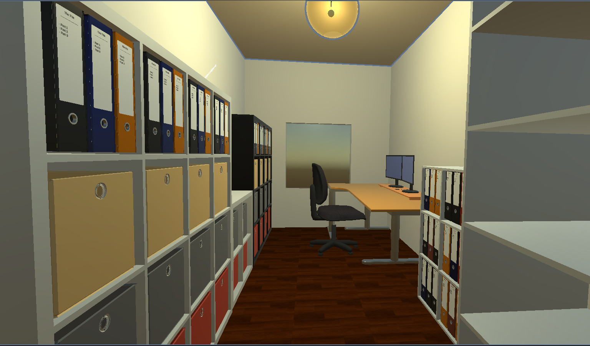
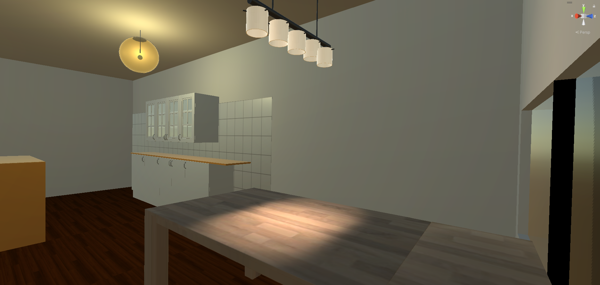

# HouseBuilder < Unity-Project >

## Overview
This folder documents the HouseBuilder Unity tools and how they are used to generate rooms, furniture, and supporting utilities. It covers JSON import/export, editor-time actions, and mesh or material helpers. Room and furniture measurements in the layouts are modeled to accurate dimensions.

## Documents
- [HouseBuilder.md](HouseBuilder.md): `houseCreator` workflow, JSON import/export, example layout generation, and the `Cl_Room` data model.
- [FurnitureWallCreator.md](FurnitureWallCreator.md): Wall-of-furniture generator, inspector actions, and a brief `FurnitureCreator` reference with template list.
- [ItemModificator.md](ItemModificator.md): Utility scripts for grid duplication, material updates, and mesh combining.

## Results
These components were used to model a flat. The project is still in progress; current snapshots:

- 
- 
- 